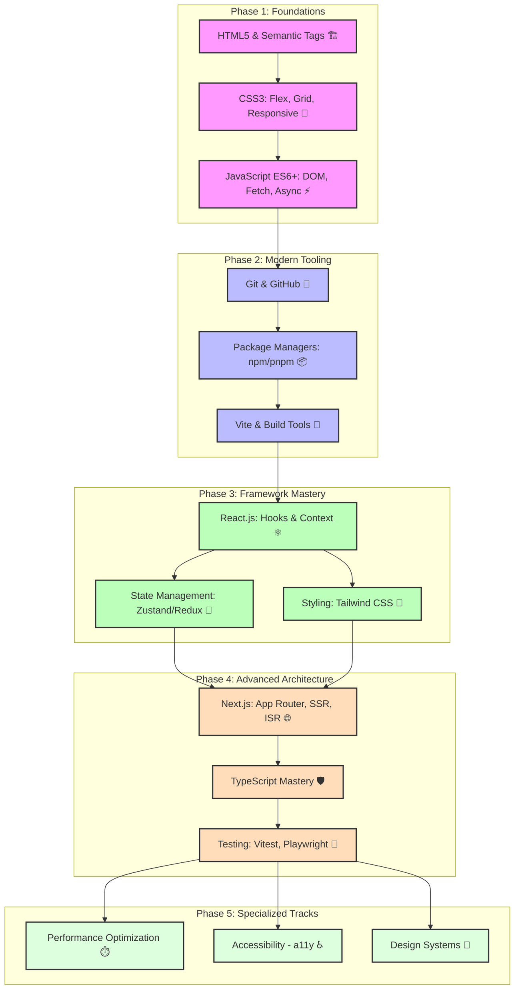

# Frontend Engineering Roadmap

## Description
Interactive visual learning path for Frontend Engineering Roadmap.

## Visual Skill Tree (Mermaid.js)

## Related Topics
- [[00_Getting_Started|Back to Home]]
- [[Index|All Skill Maps]]
