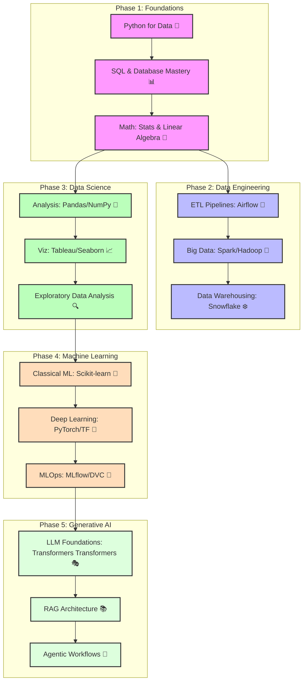

# Data & AI Roadmap

## Description
Interactive visual learning path for Data & AI Roadmap.

## Visual Skill Tree (Mermaid.js)

## Related Topics
- [[00_getting_started|Back to Home]]
- [[index|All Skill Maps]]
