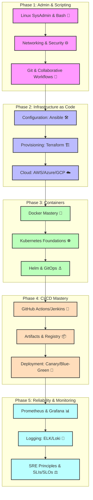

# DevOps & Cloud Roadmap

## Description
Interactive visual learning path for DevOps & Cloud Roadmap.

## Visual Skill Tree (Mermaid.js)

## Related Topics
- [[00_getting_started|Back to Home]]
- [[index|All Skill Maps]]
